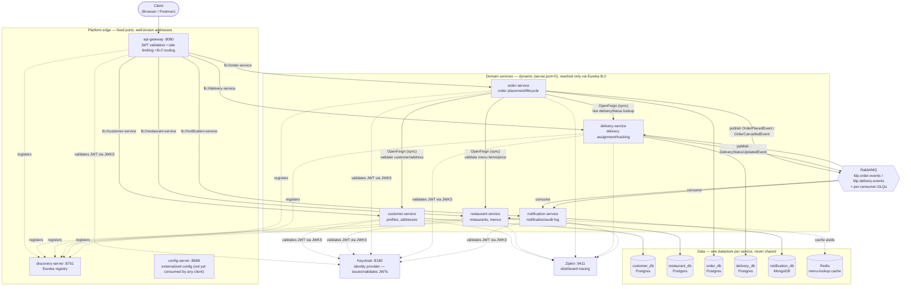
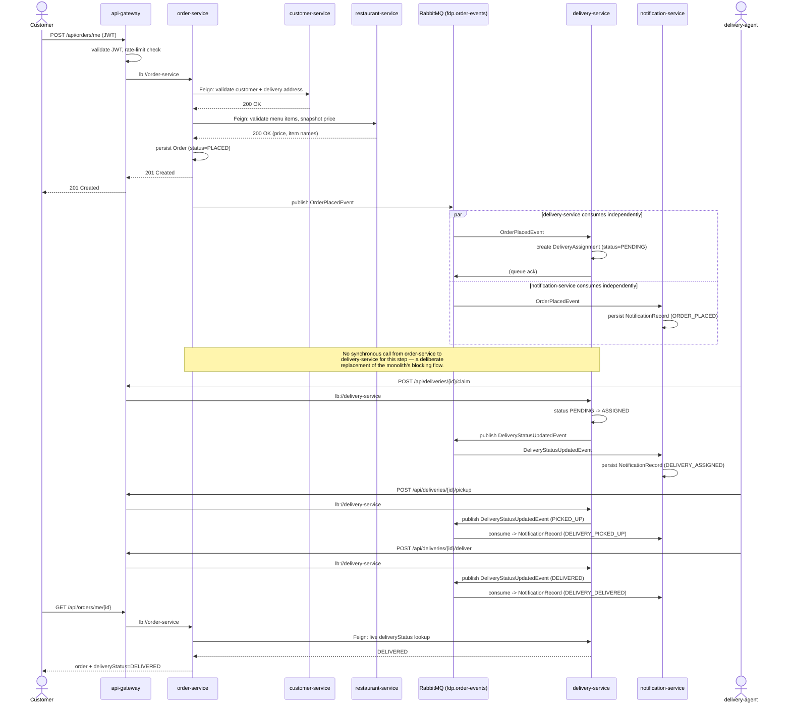
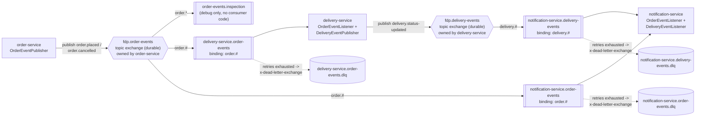

# FDP — Food Delivery Platform

A monolithic food delivery backend (Customer, Restaurant, Order, Delivery/Notification, all in one
Spring Boot app on one database) decomposed into eight independently deployable Spring Boot
microservices, wired together with Eureka service discovery, a single Spring Cloud Gateway entry
point, synchronous OpenFeign calls where a request needs an immediate answer, and asynchronous
RabbitMQ events everywhere a downstream effect shouldn't block the caller.

This document is the single project report: what the system is, how it's put together, how a
request actually flows through it, and — checked line by line against the original assignment —
which user stories are done, partially done, or still open.

> **This file is an orientation map, not the source of truth.** Every claim below links to the
> document that actually governs it. If this file and a linked doc ever disagree, the linked doc
> wins — update this one to match, not the other way around.

---

## Table of contents

- [Project overview](#project-overview)
- [System architecture](#system-architecture)
- [Request & event flow](#request--event-flow)
- [Asynchronous communication — RabbitMQ](#asynchronous-communication--rabbitmq)
- [Containerization — Dockerfile vs. Jib](#containerization--dockerfile-vs-jib)
- [Service inventory](#service-inventory)
- [Epics & user stories — verified against the implementation](#epics--user-stories--verified-against-the-implementation)
- [Documentation map](#documentation-map)
- [Running & testing the system](#running--testing-the-system)
- [Known gaps / roadmap](#known-gaps--roadmap)

---

## Project overview

**Starting point** (`docs/ReadMe.md` — the original assignment brief): one Spring Boot monolith,
one PostgreSQL database, all four domains (Customer, Restaurant/Menu, Order, Delivery) sharing
tables and calling each other via direct Java method calls. Problems that decomposition had to
solve:

- All entities shared one database with cross-domain foreign keys.
- Services called each other in-process (`OrderService` reached directly into
  `RestaurantRepository`).
- Delivery status updates were synchronous inside order placement, blocking the response.
- One JAR meant scaling order processing meant scaling everything.
- A bug in delivery tracking could crash the entire application.

**Where it ended up** — five domain services, each owning its own database and never reaching
into another's schema (`docs/RULES.md` §5), plus three platform services (`api-gateway`,
`discovery-server`, `config-server`) and Keycloak as the identity provider. This is a service
*and* a scope decomposition: the original ask was four services; the actual system also splits
notification-dispatch out of "Delivery and Notification" into its own `notification-service`
(`docs/services/notification-service.md`), and replaces a planned custom `identity-service` with
Keycloak (`docs/decisions/0001-retire-identity-service-for-keycloak.md`) — both deliberate,
documented departures from the original plan, not gaps.

The full delivery plan, sprint by sprint, with what's actually done vs. still open, lives in
[`docs/SPRINTS.md`](docs/SPRINTS.md). The binding engineering rules — service inventory,
data-ownership, sync/async rules, resilience, security, testing, CI/CD, caching, observability —
live in [`docs/RULES.md`](docs/RULES.md). This README doesn't restate either; it summarizes and
links out.

---

## System architecture



**Reading this diagram:**
- **Solid arrows** are real traffic: client → gateway → domain service, Feign calls between
  domain services, and event publish/consume through RabbitMQ.
- **Dotted arrows** are cross-cutting infrastructure concerns every service participates in
  (JWT validation, Eureka registration, tracing) rather than business traffic.
- Every domain service's box says "dynamic" on purpose — there is no fixed port to draw a stable
  arrow to. The gateway (and any other service's Feign client) resolves the actual instance through
  Eureka at call time, which is what makes two instances of the same service able to run side by
  side under load balancing (verified live — see `docs/RULES.md` §2 and `RUNNING.md`'s "I want to
  see horizontal scaling for myself").
- `config-server` is drawn but greyed out in spirit: it's implemented and reachable, but no service
  actually pulls its configuration from it yet (`docs/SPRINTS.md` Sprint 1/2 notes) — a deliberate,
  tracked scope cut, not a mistake in the diagram.

---

## Request & event flow

The order-to-delivery-to-notification path is the one flow that touches every domain service, both
synchronous (Feign) and asynchronous (RabbitMQ) communication, and is the flow
`RUNNING.md`'s own recipes and every collection under `postman/` are built to exercise end to end.



**What this proves, verified live** (not just designed this way — see `docs/SPRINTS.md` Sprints 3–5
and this session's own Postman/Newman runs):
- Placing an order never blocks on delivery or notification processing — both consume the event
  independently, on their own schedule.
- `order-service`'s own `GET /api/orders/me/{id}` shows live `deliveryStatus` via a direct Feign
  call to `delivery-service`, without ever storing delivery state itself, and degrades to `null`
  (not an error) if `delivery-service` is down.
- A customer sees exactly four notification records for one order's full lifecycle:
  `ORDER_PLACED`, `DELIVERY_ASSIGNED`, `DELIVERY_PICKED_UP`, `DELIVERED_DELIVERED` — each from an
  independently consumed event, not a single fan-out call from `order-service`.
- Stopping `restaurant-service` mid-flow makes order placement fail with a clean `503` in a few
  seconds (Resilience4j circuit breaker + Feign timeout, `docs/RULES.md` §7), not a hang — and
  recovers on its own once `restaurant-service` comes back.

---

## Asynchronous communication — RabbitMQ

### Where each communication style is actually used

Not everything is async, and not everything is sync — the split is deliberate, per call:

| Call | Style | Why |
|---|---|---|
| `order-service` → `customer-service` (validate customer + address) | **Sync** (OpenFeign) | Placing an order needs a real, immediate answer — there is no correct way to accept an order for a customer/address that turns out not to exist. |
| `order-service` → `restaurant-service` (validate menu items, snapshot price) | **Sync** (OpenFeign) | Same reason: the authoritative price *at the moment of placement* must be known before the order is persisted, not discovered later. |
| `order-service` → `delivery-service` (`GET /api/orders/me/{id}`'s live `deliveryStatus`) | **Sync** (OpenFeign) | A read of current state, needed right now to answer the caller — and it degrades to `null`, not an error, if `delivery-service` is down, so this sync call is never a hard dependency for placing an order. |
| `order-service` **→(event)→** `delivery-service` (create the delivery assignment) | **Async** (RabbitMQ) | This is exactly the monolith's original problem (`docs/ReadMe.md` "Key problems to solve": *"Delivery status updates are sent synchronously inside the order flow, blocking the response"*). Assignment creation is a side effect of placing an order, not something the customer's `201 Created` should ever wait on or fail because of. |
| `order-service` **→(event)→** `notification-service` (record `ORDER_PLACED`/`ORDER_CANCELLED`) | **Async** (RabbitMQ) | Same reasoning — a customer's order placement must never fail or slow down because the notification/audit log happens to be unavailable. |
| `delivery-service` **→(event)→** `notification-service` (record each status transition) | **Async** (RabbitMQ) | An agent's `claim`/`pickup`/`deliver` call must respond immediately; notification dispatch is a downstream side effect, not part of that transaction. |

The rule in one sentence: **use sync REST/Feign when the caller genuinely cannot proceed without
an answer right now** (validation, a live read); **use an async event when the caller doesn't need
to wait for a downstream side effect, and must not be coupled to that downstream's availability**
(`docs/RULES.md` §6). This is also why `delivery-service` never calls `order-service` synchronously
to "fetch order details" the way `docs/ReadMe.md`'s original Epic 1.2 text describes — Epic 4.1's
later, more specific requirement (non-blocking delivery) supersedes it, and the actual data
`delivery-service` needs (`restaurantId`, `customerKeycloakId`, `deliveryAddressId`) already rides
along inside the event payload itself, so no callback is even necessary.

### RabbitMQ topology — exchanges, queues, bindings, dead letters



| Exchange | Type | Owner (publishes) | Routing keys used | Consumer queues bound to it |
|---|---|---|---|---|
| `fdp.order-events` | topic, durable | `order-service` | `order.placed`, `order.cancelled` | `order-events.inspection` (`order.*`, debug only), `delivery-service.order-events` (`order.#`), `notification-service.order-events` (`order.#`) |
| `fdp.delivery-events` | topic, durable | `delivery-service` | `delivery.status-updated` | `notification-service.delivery-events` (`delivery.#`) |

Per `docs/RULES.md` §6, **a publisher owns the exchange it publishes to, and every consumer owns
its own queue, binding, and dead-letter queue — never shared between consumers.** That's why there
are two separate queues bound to `fdp.order-events` (one per consumer service) rather than one
shared queue two services both read from, and why `notification-service` — the one service that
consumes from *both* exchanges — has two entirely separate DLX/DLQ pairs, not one: a poisoned
message on `fdp.delivery-events` must never block or get tangled up with `fdp.order-events`
consumption.

### How a service actually "subscribes"

There's no service-to-service subscription API — it's plain AMQP topic-exchange fan-out, wired up
in each service's own `messaging/RabbitConfig.java`:

1. **Re-declare the exchange, idempotently.** Every consumer service's `RabbitConfig` re-declares
   the *same* exchange (same name, same durability flags) its publisher already declared. AMQP
   exchange declaration is idempotent, so this is safe — and necessary, since a consumer service
   might start before its publisher does and still needs the exchange to exist to bind a queue to.
2. **Declare your own queue + binding — never touch anyone else's.** Each consumer declares its
   own `Queue` bean, with a routing-key binding pattern (`order.#` / `delivery.#` — `#` matches any
   number of words, `*` matches exactly one, so `order-events.inspection`'s `order.*` deliberately
   only catches `order.placed`/`order.cancelled` while `order.#` would also catch future
   multi-segment keys like `order.item.added`).
3. **Attach a listener.** A `@Component` class declares a method annotated
   `@RabbitListener(queues = "<that exact queue name>")`. Spring AMQP's auto-configured listener
   container (`spring-boot-starter-amqp`) opens a consumer channel to that queue and invokes the
   method for every message the broker delivers — this is the actual "subscription": binding +
   `@RabbitListener`, nothing more exotic than that.
4. **Deserialize explicitly, not automatically.** Every listener here takes the raw
   `org.springframework.amqp.core.Message` and converts it itself via the injected
   `MessageConverter` (a shared `JacksonJsonMessageConverter`, Jackson 3 — matching Boot 4's own
   `ObjectMapper`, not the legacy Jackson 2 converter Spring AMQP still ships for compatibility). A
   generic `Object`-typed `@RabbitListener` parameter was tried first and doesn't give Spring's
   listener adapter enough type information to auto-convert — it silently hands the method the raw
   `Message` instead, a real bug this codebase hit and fixed (see `OrderEventListener`'s own
   javadoc in `delivery-service`/`notification-service`). The converter's `trustedPackages` is
   locked to `food_delivery.Platform.common.event` — a real security boundary: a consumer refuses
   to deserialize any class outside that package, rather than blindly trusting whatever a message
   header claims its payload type is.
5. **At-least-once delivery means every consumer must deduplicate itself.** RabbitMQ guarantees a
   message is delivered at least once, never exactly once — a redelivery (broker restart, a
   momentary connection blip, requeue-after-nack) is normal, not a bug. Neither consumer relies on
   an application-level "check if it exists first" as its real guard (that's a plain
   find-then-save with no locking — two near-simultaneous redeliveries can both pass the check
   before either has saved). The actual guard is a **unique database index**: `delivery-service`
   catches `DataIntegrityViolationException` on `DeliveryAssignment.orderId`'s unique index;
   `notification-service` catches `DuplicateKeyException` on `NotificationRecord.eventId`'s unique
   Mongo index (which itself requires `spring.data.mongodb.auto-index-creation=true` — without it,
   `@Indexed(unique = true)` is declared but never actually enforced, a real bug this project's own
   integration test caught). Either way, a losing concurrent write is treated as "already
   processed," not an error.
6. **Retry, then dead-letter — no custom recovery code.** `spring.rabbitmq.listener.simple.retry`
   (`enabled=true`, `max-attempts=3`, `initial-interval=500ms`) retries a throwing listener locally
   first. Once attempts are exhausted, Spring AMQP's default recoverer rejects the message *without
   requeue*, and the broker itself — not application code — routes it to whatever
   `x-dead-letter-exchange`/`x-dead-letter-routing-key` that queue was declared with. This is a
   queue *argument*, set once at declaration time (see `QueueBuilder.durable(...).withArguments(...)`
   in any consumer's `RabbitConfig`), not something the listener method has to implement.
7. **The publish/consume hop is a real trace span, not a black box.** Both the `RabbitTemplate` and
   the listener container are built through Spring Boot's own auto-configuration/`RabbitTemplateConfigurer`
   rather than `new RabbitTemplate(...)` directly, specifically so
   `spring.rabbitmq.template.observation-enabled` / `listener.simple.observation-enabled` apply —
   without that, a hand-constructed template carries no trace-propagation headers, and the publish
   never shows up as a span in the same Zipkin trace as the HTTP request that triggered it (this
   was empirically confirmed missing before the fix, against a real running Zipkin — see
   `docs/technologies/zipkin.md`).

---

## Containerization — Dockerfile vs. Jib

**Straight answer: neither exists in this repo yet.** There is no `Dockerfile` anywhere under any
service, and no service's `pom.xml` configures `jib-maven-plugin` — confirmed by grepping the
entire repo. This isn't an oversight; it's tracked, explicit Sprint 7 scope
(`docs/SPRINTS.md`), and both `docs/technologies/jib.md` and `docs/technologies/docker.md` already
document the *intended* approach ahead of the code that will implement it — a deliberate practice
this project follows throughout (`docs/RULES.md` §17: a service/technology's reference doc ships
in the same PR as the code that introduces it; here, the docs were written first as the plan).

### The plan, once Sprint 7 lands

Two separate, intentionally non-redundant build paths, per service:

| | **Jib** (`jib-maven-plugin`) | **Dockerfile** (hand-written) |
|---|---|---|
| **Purpose** | The actual CI/production image-build path | Learning purposes and manual `docker build`, never what CI runs |
| **Needs a Docker daemon?** | `jib:build` (push straight to a registry) — **no**. `jib:dockerBuild` (local-only image) — yes, that's the one Jib mode that needs one. | Yes, always (`docker build` itself requires the daemon) |
| **Configured where** | Each service's own `pom.xml` (never the root aggregator — matches `docs/RULES.md` §4's "a service's own `pom.xml` never pins a version, and only depends on what it actually needs") | Each service's own repo folder, alongside its `pom.xml` |
| **Build stages** | N/A — Jib assembles layers directly from the compiled Maven output, no intermediate image | Multi-stage: a build stage (compiles the module) → a slim runtime stage (copies only the built artifact) |
| **Who runs it, and when** | CI, on every merge to `main` — `mvn jib:build`, tagging the image with the git SHA (plus a semver tag for releases) | A developer, manually, if they want to build/inspect an image without Maven |
| **What `docker-compose.yml` will reference** | The image Jib produced (`jib:dockerBuild` locally, or the registry tag CI already pushed) | Not referenced by the standard `docker compose up` flow at all |

The two paths must be kept in sync by hand whenever a service's runtime dependencies change (e.g.
a new JDK base image) — they are deliberately not generated from one another.

### Why Jib over a plain `docker build` for CI specifically

- **No Docker daemon needed in the CI runner** for the actual push path (`jib:build`) — this is
  Jib's whole selling point over `docker build`, which always needs one.
- **Reproducible layers straight from the Maven build** — faster and more deterministic than
  wrapping a `docker build` around a separately-run `mvn package`.
- **The same image is promoted unchanged** from CI through staging to production (`docs/RULES.md`
  §1 factor 5's "build once, run everywhere") — nothing is rebuilt per environment.

### Commands (not runnable yet — no service has the plugin configured)

```bash
./mvnw -pl <service> -am jib:dockerBuild   # local-only image; needs a running Docker daemon
./mvnw -pl <service> -am jib:build         # builds + pushes to a registry; no daemon needed —
                                            # this is the command CI will run on merge to main
```

---

## Service inventory

| Service | Responsibility | Datastore | Port | Registers with Eureka |
|---|---|---|---|---|
| `config-server` | Centralized externalized configuration | — | `8888` (fixed) | no (nothing consumes it yet) |
| `discovery-server` | Eureka service registry | — | `8761` (fixed) | is the registry |
| `api-gateway` | Single entry point: routing, JWT validation, rate limiting | — | `8080` (fixed) | yes |
| `customer-service` | Customer profiles, delivery addresses | `customer_db` (Postgres) | dynamic | yes |
| `restaurant-service` | Restaurants, menus, menu items | `restaurant_db` (Postgres) | dynamic | yes |
| `order-service` | Order placement, order lifecycle | `order_db` (Postgres) | dynamic | yes |
| `delivery-service` | Delivery assignment and tracking | `delivery_db` (Postgres) | dynamic | yes |
| `notification-service` | Consumes domain events, persists notification/audit log | `notification_db` (MongoDB) | dynamic | yes |
| `common` | Shared library (error envelope, exception handling, JWT role converter) — not a runnable service | — | — | — |

Backing infrastructure (not FDP services, but required): PostgreSQL, MongoDB, RabbitMQ, Redis,
Keycloak (`:8180`), Zipkin (`:9411`) — all defined in `docker-compose.yml`. Elasticsearch,
Logstash, Kibana, Prometheus, and Grafana are planned (`docs/RULES.md` §13, Sprints 6/9) but not
yet added.

Full rationale for why each is its own service, its tech stack, and its permission model lives in
`docs/services/<name>.md`.

---

## Epics & user stories — verified against the implementation

`docs/ReadMe.md` is the original assignment brief and its five epics/ten user stories are the
project's actual acceptance criteria. Status below is checked against `docs/SPRINTS.md` (the
sprint-by-sprint build log) and this session's own live testing (see
[Running & testing the system](#running--testing-the-system)) — not
just "the code exists somewhere."

Legend: ✅ done and verified live · ⚠️ partially done · ❌ not started (deliberately, tracked)

### Epic 1 — Service Decomposition and Database Separation

| # | User story | Status | Evidence |
|---|---|---|---|
| 1.1 | Decompose the monolith into independently deployable services, each with its own database | ✅ | Five domain services (exceeds the original four — `notification-service` split out too), each with its own `pom.xml`, own entry point, own database (`customer_db`/`restaurant_db`/`order_db`/`delivery_db` Postgres, `notification_db` MongoDB). No shared tables, no cross-service JPA entity (`docs/RULES.md` §5). |
| 1.2 | Replace direct entity relationships with REST-based communication | ✅ (with one deliberate improvement) | `order-service` → `customer-service`/`restaurant-service` via real OpenFeign calls, Eureka-resolved, with the caller's own token relayed (Sprint 3). The brief's own text also asks `delivery-service` to call `order-service` via REST — the actual system uses an async RabbitMQ event instead, per Epic 4.1's later, more specific requirement to make delivery non-blocking. That's a superseding choice, not a gap: `delivery-service` *does* expose `GET /by-order/{orderId}` for `order-service`'s own Feign-based live tracking lookup, so the REST path still exists, just in the other direction. |

### Epic 2 — Containerization with Docker

| # | User story | Status | Evidence |
|---|---|---|---|
| 2.1 | Each microservice containerized; `docker compose up` starts the complete system | ⚠️ | `docker-compose.yml` runs all backing infrastructure (Postgres, MongoDB, RabbitMQ, Redis, Keycloak, Zipkin) with health checks and correct dependency ordering — but the eight FDP services themselves are **not yet containerized**; they run via Maven/jar (`RUNNING.md`). Explicitly Sprint 7 scope, not started. |
| 2.2 | Docker-specific Spring profiles (`application-docker.yml`, container hostnames) | ❌ | Not started — same Sprint 7 scope as above. |

### Epic 3 — Service Discovery and API Gateway

| # | User story | Status | Evidence |
|---|---|---|---|
| 3.1 | Eureka service discovery, dynamic lookup, no hardcoded URLs | ✅ | `discovery-server` standalone Eureka, dashboard at `:8761`. Every domain service + `api-gateway` registers on startup; verified live with two `customer-service` instances registering side by side under different ports. |
| 3.2 | API Gateway: routing, JWT auth filter, Eureka load-balanced routing, rate limiting | ✅ | `api-gateway` routes all five domain services via `lb://`; JWT validated at the edge (reactive OAuth2 Resource Server against Keycloak's JWKS) before any route resolves; `RequestRateLimiter` on order placement backed by Redis, verified live (burst of 20 concurrent requests produces real `429`s once the burst capacity of 10 is exhausted). |

### Epic 4 — Event-Driven Communication

| # | User story | Status | Evidence |
|---|---|---|---|
| 4.1 | Event-driven delivery/notification via RabbitMQ, non-blocking order placement | ✅ | `order-service` publishes `OrderPlacedEvent`/`OrderCancelledEvent` to a durable topic exchange; `delivery-service` and `notification-service` each consume independently and auto-create their own records; both have a per-consumer dead-letter queue. Verified live end to end multiple times, including via this session's Newman runs. |
| 4.2 | Circuit breakers on inter-service calls, graceful degradation | ✅ | Resilience4j circuit breaker + retry + bulkhead on every `order-service` Feign client (`customer-service`, `restaurant-service`, `delivery-service`), with typed fallbacks. Verified live: stopping `restaurant-service` produces a clean `503` in ~7s (not a hang), circuit breaker state visible on `/actuator/circuitbreakers`, and order placement recovers on its own once the dependency returns — orders can still be placed while `delivery-service` is down (it's consulted only for the optional `deliveryStatus` field, not required to place an order). |

### Epic 5 — Testing and Documentation

| # | User story | Status | Evidence |
|---|---|---|---|
| 5.1 | End-to-end testing via Postman, full order flow, event-driven flow, fault tolerance | ✅ | A Postman collection per domain service (5 total, 98 requests / 132 assertions combined) plus a shared environment, covering the full register → browse → place order → delivery assigned → delivery completed flow, the async event-driven path, and fault-tolerance (stop a service, confirm graceful degradation, confirm recovery). All five collections were re-verified via `newman` this session — 100% pass, 0 failures, against the actually-running stack (not a mock). |
| 5.2 | Comprehensive documentation: architecture diagram, API contracts, migration log, setup README | ⚠️ | API contracts are live (`/v3/api-docs` + Swagger UI on every domain service), not a static file under a `docs/api-contracts/` folder. A migration decision log exists (`docs/decisions/0001-retire-identity-service-for-keycloak.md`) but records only one decision so far. **This document is the first architecture diagram and root setup README** the project has had — both were open items (`docs/SPRINTS.md` Sprint 8) until now. |

**Scope added beyond the original brief** (tracked in `docs/RULES.md`, not `docs/ReadMe.md`,
since it postdates the original assignment): Keycloak as the identity provider in place of a
custom `identity-service`; `notification-service` as its own service rather than folded into
delivery; Redis caching on restaurant/menu lookups; Zipkin distributed tracing and structured JSON
logging across every domain service. See `docs/SPRINTS.md` Sprints 1, 5, 6 for each.

---

## Documentation map

| Document | What it covers |
|---|---|
| [`docs/ReadMe.md`](docs/ReadMe.md) | The original assignment: epics, user stories, acceptance criteria, evaluation rubric |
| [`docs/RULES.md`](docs/RULES.md) | Binding engineering rules — service inventory, repo structure, dependency management, data ownership, communication, resilience, security, testing, containerization, CI/CD, caching, observability |
| [`docs/SPRINTS.md`](docs/SPRINTS.md) | Sprint-by-sprint build log — what's actually done, verified live, or still open, per sprint |
| [`docs/services/`](docs/services) | One doc per service: responsibility, why it's separate, design decisions |
| [`docs/technologies/`](docs/technologies) | One doc per technology (Eureka, Keycloak, RabbitMQ, Redis, Resilience4j, Zipkin, …): what it's for and the real gotchas hit integrating it |
| [`docs/decisions/`](docs/decisions) | Architecture decision records — why a boundary or technology choice was made |
| [`RUNNING.md`](RUNNING.md) | How to start infrastructure and services, Swagger/Keycloak/Zipkin/RabbitMQ endpoints, troubleshooting |
| [`credentials.md`](credentials.md) | Seeded Keycloak demo accounts and auth endpoints |
| [`postman/`](postman) | One Postman collection per domain service + a shared environment |
| [`CLAUDE.md`](CLAUDE.md) | Instructions for AI coding agents working in this repo |

---

## Running & testing the system

Full reference (every recipe, Swagger/Keycloak/Zipkin/RabbitMQ endpoints, troubleshooting) lives in
[`RUNNING.md`](RUNNING.md) — this section is a self-contained, copy-pasteable walkthrough from a
clean checkout to a verified, fully working system.

### Prerequisites

- **Docker Desktop** running — every infra container and Testcontainers-backed test needs it.
- **JDK 25**. No local Maven install needed — every command below uses the vendored wrapper
  (`./mvnw` / `.\mvnw.cmd`).
- Optional, for the end-to-end test run: **Node.js** (`npx` ships with it) — used to run `newman`,
  Postman's CLI runner, with no separate install.

### 1. Start infrastructure

```bash
docker compose up -d
docker compose ps          # wait for every container to show "healthy", not just "Up" —
                            # Keycloak's realm import in particular can take 20-40s on first start
```
This brings up Postgres, MongoDB, RabbitMQ, Redis, Keycloak, and Zipkin — nothing FDP-owned yet.

### 2. Build every module

```bash
./mvnw clean package -DskipTests
```
Builds the whole reactor (`common` + all eight services) in dependency order. Leave `-DskipTests`
off if you want the Testcontainers-backed suite to run as part of the build instead of separately
(see [Automated tests](#automated-tests) below).

### 3. Start the services, in dependency order

`discovery-server`/`config-server` first (the platform's spine), then the five domain services
(order doesn't strictly matter between them, but `order-service` will retry its Feign calls to
`customer-`/`restaurant-service` if they're not registered yet rather than fail hard), then
`api-gateway` last, since it needs something registered in Eureka to route to:

```bash
java -jar discovery-server/target/discovery-server-0.0.1-SNAPSHOT.jar > discovery-server.log 2>&1 &
java -jar config-server/target/config-server-0.0.1-SNAPSHOT.jar     > config-server.log     2>&1 &
# wait ~20s for both to report "Started ... Application" in their logs, then:
java -jar customer-service/target/customer-service-0.0.1-SNAPSHOT.jar         > customer-service.log     2>&1 &
java -jar restaurant-service/target/restaurant-service-0.0.1-SNAPSHOT.jar     > restaurant-service.log   2>&1 &
java -jar order-service/target/order-service-0.0.1-SNAPSHOT.jar               > order-service.log        2>&1 &
java -jar delivery-service/target/delivery-service-0.0.1-SNAPSHOT.jar         > delivery-service.log     2>&1 &
java -jar notification-service/target/notification-service-0.0.1-SNAPSHOT.jar > notification-service.log 2>&1 &
# wait ~60-100s for all five to report "Started ... Application" (first boot is the slowest —
# Flyway migrations, Hibernate validation, Eureka registration), then:
java -jar api-gateway/target/api-gateway-0.0.1-SNAPSHOT.jar > api-gateway.log 2>&1 &
```
(PowerShell: swap the trailing `&` for `Start-Process`, or open one terminal per service — see
`RUNNING.md`'s "Starting FDP services" for both shells side by side.)

### 4. Verify everything actually registered

```bash
curl -s http://localhost:8761/eureka/apps -H "Accept: application/json" | grep -o '"name":"[A-Z-]*"'
```
Expect `CUSTOMER-SERVICE`, `RESTAURANT-SERVICE`, `ORDER-SERVICE`, `DELIVERY-SERVICE`,
`NOTIFICATION-SERVICE`, and `API-GATEWAY` — six names. (`discovery-server` is the registry, not a
client of itself; `config-server` doesn't register since nothing consumes it yet — see
[System architecture](#system-architecture).) Then confirm the gateway itself sees all of them as
`UP`:
```bash
curl -s http://localhost:8080/actuator/health | grep -o '"status":"UP"' | wc -l
```

### 5. Get an auth token

```bash
curl -s -X POST http://localhost:8180/realms/fdp/protocol/openid-connect/token \
  -H "Content-Type: application/x-www-form-urlencoded" \
  -d "grant_type=password&client_id=fdp-api&username=customer@fdp.test&password=Customer@123&scope=openid" \
  | grep -o '"access_token":"[^"]*"'
```
All four seeded demo accounts (`CUSTOMER`/`ADMIN`/`RESTAURANT_OWNER`/`DELIVERY_AGENT`) and their
passwords are in [`credentials.md`](credentials.md).

### 6. Try it — place a real order end to end

```bash
TOKEN="<access_token from step 5>"
curl -s -X POST http://localhost:8080/api/customers/me -H "Authorization: Bearer $TOKEN" \
  -H "Content-Type: application/json" -d '{"phoneNumber":"+15551234567"}'      # register once
curl -s -X POST http://localhost:8080/api/customers/me/addresses -H "Authorization: Bearer $TOKEN" \
  -H "Content-Type: application/json" \
  -d '{"label":"Home","street":"12 Kigali Ave","city":"Kigali","state":"Kigali City","postalCode":"00000","country":"Rwanda","isDefault":true}'
curl -s http://localhost:8080/api/restaurants -H "Authorization: Bearer $TOKEN"  # find a restaurantId + menuItemId
curl -s -X POST http://localhost:8080/api/orders/me -H "Authorization: Bearer $TOKEN" \
  -H "Content-Type: application/json" \
  -d '{"restaurantId":1,"deliveryAddressId":1,"items":[{"menuItemId":1,"quantity":1}]}'
```
A `201 Created` with `"status":"PLACED"` means the whole chain worked: gateway JWT validation →
`order-service` → Feign calls to `customer-`/`restaurant-service` → RabbitMQ publish. Everything
goes through `api-gateway` on `:8080` — no domain service has a fixed port to call directly (see
[System architecture](#system-architecture)).

### Automated tests

**Unit/integration tests** — Testcontainers-backed (a real Postgres/MongoDB/RabbitMQ per test
class, never mocks or an in-memory substitute):
```bash
./mvnw test                    # every module
./mvnw -pl order-service test  # one service only
```
Requires Docker Desktop running (Testcontainers starts and tears down real containers per test
class) — see `docs/SPRINTS.md`'s per-service notes for exact counts and what each class covers.

**End-to-end (Postman/Newman)** — one collection per domain service under `postman/`, plus a
shared `FDP.postman_environment.json`. Every collection is idempotent against a re-run (registration
steps tolerate "already exists," prerequisite setup re-opens any restaurant a previous run closed),
and requires the full stack from steps 1–4 above to already be running:
```bash
cd postman
npx --yes newman run FDP-customer-service.postman_collection.json     -e FDP.postman_environment.json
npx --yes newman run FDP-restaurant-service.postman_collection.json   -e FDP.postman_environment.json
npx --yes newman run FDP-order-service.postman_collection.json        -e FDP.postman_environment.json
npx --yes newman run FDP-delivery-service.postman_collection.json     -e FDP.postman_environment.json --delay-request 500
npx --yes newman run FDP-notification-service.postman_collection.json -e FDP.postman_environment.json --delay-request 800
```
(The `--delay-request` on the last two gives RabbitMQ's async consumption a moment to catch up
before the collection asserts on its result — event delivery is typically a few hundred
milliseconds, never simultaneous with the HTTP response that triggered it.) All five were verified
100% green this way, against the live stack, not a mock:

| Collection | Requests | Assertions |
|---|---|---|
| customer-service | 23/23 | 29/29 |
| restaurant-service | 22/22 | 29/29 |
| order-service | 18/18 | 25/25 |
| delivery-service | 20/20 | 28/28 |
| notification-service | 15/15 | 21/21 |

**Manual fault-tolerance drill** — stop a downstream service mid-flow and confirm graceful
degradation, not a hang:
```bash
curl -s http://localhost:8761/eureka/apps/RESTAURANT-SERVICE -H "Accept: application/json" \
  | grep -o '"port":{[^}]*}'                      # find its current (dynamic) port
# find and stop that PID (Get-NetTCPConnection/taskkill, or netstat/kill — see RUNNING.md),
# then place another order through the gateway: expect a clean 503 in a few seconds, not a hang.
# Restart restaurant-service; wait ~10s (circuit breaker's wait-duration-in-open-state); order
# placement recovers on its own, no restart of order-service needed.
```

---

## Known gaps / roadmap

Tracked in `docs/SPRINTS.md`, not hidden:

- **Containerization (Sprint 7)** — neither a per-service `Dockerfile` nor Jib is wired up yet;
  only backing infrastructure runs in containers today. See
  [Containerization — Dockerfile vs. Jib](#containerization--dockerfile-vs-jib) for the full plan.
- **`config-server` integration** — implemented and reachable, but no service pulls config from it
  yet; every service still configures itself via its own `application.properties`.
- **Elasticsearch/Logstash/Kibana (Sprint 6)** — structured JSON logs with trace-correlated fields
  exist on every service's stdout; nothing ships them to a log store yet.
- **Prometheus/Grafana (Sprint 9)** — Actuator/Micrometer expose the metrics; no scraping or
  dashboards yet.
- **Static API contract docs** — live Swagger/OpenAPI exists per service; no committed
  `docs/api-contracts/` snapshot yet.
- **`api-gateway` tracing** — the one domain-adjacent service without a Zipkin dependency of its
  own yet, so it doesn't appear as a span in an otherwise-complete trace.

None of these block the platform from running end to end today — placing a real order, tracking
it through delivery, and seeing every notification land, all work, verified live, right now.
